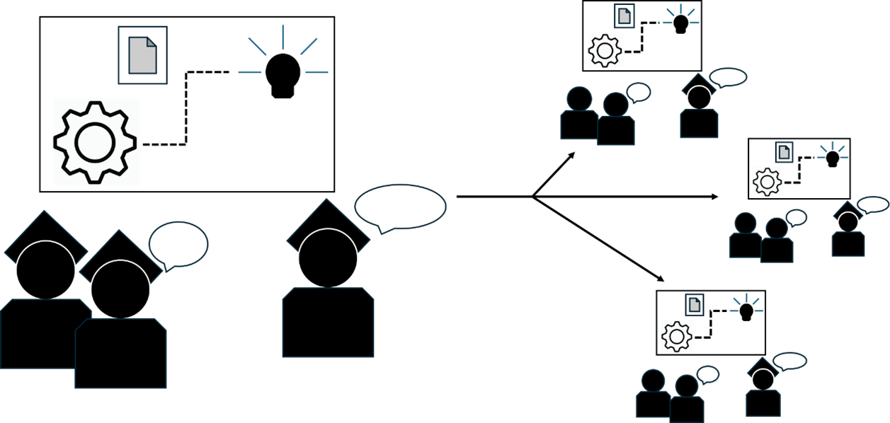

# DoedeFysica

In het VO is er veel aandacht voor ontwikkeling van conceptuele kennis. Die kennis wordt met name ontwikkeld door middel van klassikale instructie: de docent legt de stof uit waarna de leerlingen sommen oefenen. Door een (over)vol programma, maar ook onbekendheid met de didactiek en gering aantal goede voorbeelden, zijn practica, ontwerpopdrachten en computer gebruik (waaronder data-analyse en simulaties) geminimaliseerd. Dit terwijl juist deze activiteiten als leuk en motiverend ervaren worden en er op bètavervolgopleidingen juist veel aandacht voor deze onderwijselementen is. In het MBO/HBO voeren o.a. ontwerpen en praktische opdrachten de boventoon. In het WO is er veel aandacht voor (wetenschappelijk) experimenten, daarbij gebruik makend van de diverse mogelijkheden van de computer. 

Dit project beoogt het plezier in actief leren terug te brengen, de opbrengst daarvan te vergroten en de kloof tussen het secundair en tertiair onderwijs te verkleinen. Dit doen we door een online, open-access boek te publiceren met door docenten geteste practica en bijbehorende didactiek (workpackage 1), cursussen te (door)ontwikkelen rond deze thema’s (workpackage 2), en train-de-trainerprogramma’s aan te bieden om de implementatie van dit onderwijs op verschillende locaties mogelijk te maken (workpackages 3).

