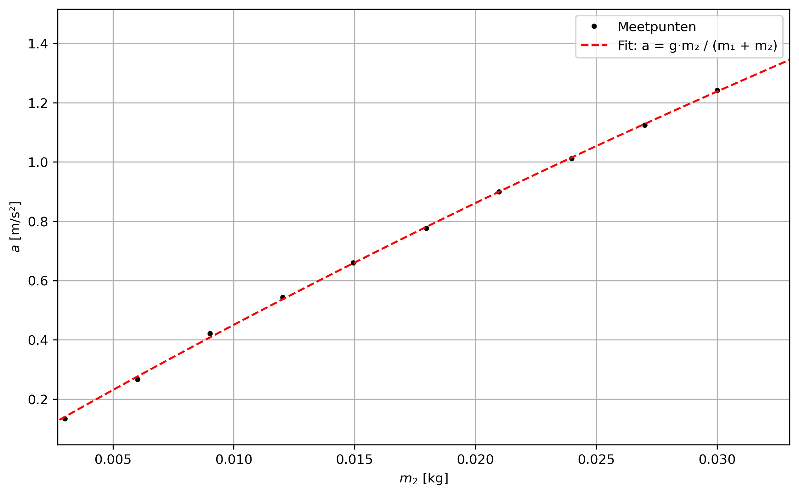

---
numbering:
  headings:
    title: true
    enabled: true 
    
downloads:
    - file: Atwood SGO.docx
    - title: SGO
    - file: Atwood NB.ipynb
    - title: Notebook
    - file: Atwood WB.docx
    - title: Werkblad
---

# Atwood en Newton de tweede
Dit is een voorbeeld experiment zoals opgenomen zal worden in het boek Doe*de*Fysica. Het betreft metingen aan het toestel van Atwood.

## Experiment
Het toestel van Atwood is een klassiek experiment waarmee leerlingen op eenvoudige wijze de wetten van Newton kunnen onderzoeken. Door twee gewichten via een katrol met elkaar te verbinden, wordt inzichtelijk hoe krachten en versnellingen samenwerken. 

Het *leerdoel* is dus een beter begrip van de tweede wet van Newton. Het *practicumdoel* is het zo precies mogelijk bepalen van de massa van het wagentje.

### Methode

#### Ontwerp
In dit experiment, zie {numref}`fig_Atwood_setup` wordt een karretje met onbekende massa $m_1$ versneld doordat er een zwaartekracht werkt op een massa ($m_2$). De versnelling aan het systeem wordt gegeven door:

$$
\begin{aligned}
F_{net} &= F_{z,m_2}\\
(m_1 + m_2) \cdot a &= m_2 \cdot g
\end{aligned}
$$

Door verschillende massa's $m_2$ te gebruiken en de totale versnelling te bepalen kunnen ze de op basis van de tweede wet van Newton de onbekende massa van het karretje bepalen. 

```{figure} Atwood.png
:width: 70%
:name: fig_Atwood_setup 
:alt: De Atwood-opstelling bestaat uit een luchtbaan met daarop een karretje en een gewicht dat met een klein draadje aan het karretje is bevestigd.

De opstelling van Atwood: een karretje op een luchtkussenbaan wordt versneld door een massa bevestigd aan het karretje via een draadje dat loopt over een lichtlopend katrol.
```

Die versnelling kan op verschillende manieren bepaald worden:

::::{tab-set}
:::{tab-item} speedgate
Op afstand $s$ van de start staat een speedgate welke de momentane snelheid $v_e$ weergeeft. Uitgaande van een eenparig versnelde beweging geldt:

$$
\begin{aligned}
a &= \frac{\Delta v}{\Delta t}
  &= \frac{v_e}{s/v_e/2}
  &= \frac{v_e^2}{2s}
\end{aligned}
$$
:::
:::{tab-item} stopwatch
De tijd $t$ die nodig is voor het karretje om een afstand $s$ af te leggen startend vanuit stilstand wordt gegeven door: 

$$
s = 1/2 \cdot a \cdot t^2
$$

herschreven voor $a$:

$$
a = \frac{2 \cdot s}{t^2}
$$

:::
:::{tab-item} versnellingsmeter
De versnelling $a$ wordt direct bepaald uit de gemiddelde versnelling gegeven door de sensor.
::::

#### Benodigdheden
* Luchtkussenbaan
* Karretje 
* Verschillende massa's
* Lichtsluis / stopwatch / pocket voyager[^fn1] 
* Launcher*

#### Uitvoering

::::{tab-set}

:::{tab-item} speedgate

:::

:::{tab-item} stopwatch
Hier met de stopwatch
:::
:::{tab-item} pocket voyager
en de pocket
::::


### Resultaten
::::{tab-set}
:::{tab-item} speedgate
| $m_2$ (g)| $v_e$ (m/s) | $a$ (m/s$^2$) |
| --- | --- | --- |
| 3| | 0.13 |
| 6 | | 0.27 |
| 9 | | 0.42 |
| 12 | 0.978 | 0.54 |
| 15 | 1.109 | 0.66 |
| 18 | 1.205 | 0.78 |
| 21 | 1.284 | 0.90 |
| 24 | 1.360 | 1.01 |
| 27 | 1.407 | 1.12 |
| 30 | 1.479| 1.24 |



$m_2$ uit de fit is: 0.2078 ± 0.0006 kg.  
$m_2$ gewogen is .1993176±0.00005 kg.  
:::
:::{tab-item} stopwatch
Hier met de stopwatch
:::
:::{tab-item} pocket voyager

::::

### Conclusie

## Didactiek
### Optie 1: CDC aanpak
Elke groepje bepaalt nauwkeurig de versnelling bij een enkele massa ($m_2$). De metingen worden gecombineerd door de docent: $a(m_2)$. Gezamenlijk wordt het resultaat besproken, de voorspelde grafiek is op het bord weergegeven m.b.v. [geogebra](https://geogebra.org). De metingen worden door de leerlingen toegevoegd.

### Optie 2: PO
Elk groepje bepaalt op basis van een éénpuntsmeting (welke afstand kun je het beste gebruiken en waarom?) de versnelling. Ze variëren zelf de massa van $m_2$. Welke massa's gebruik je en waarom?

[^fn1]: Verschillende mogelijkheden om de versnelling te bepalen

