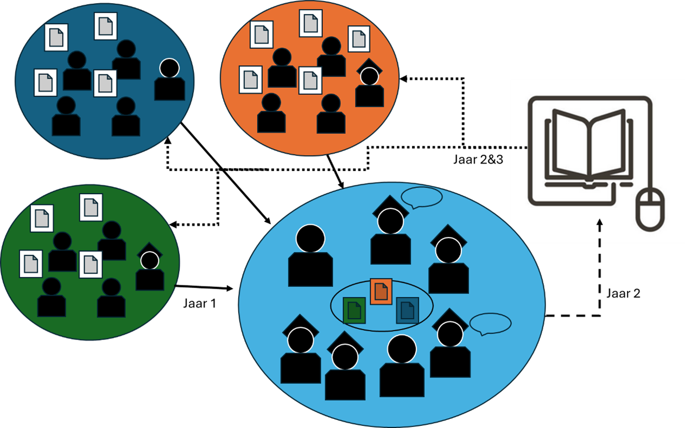
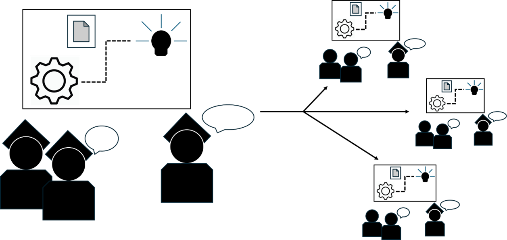

# Newton de eerste

Newton is best cool, maar ligt nog in bed.

:::{figure}
:label: my-figure
:align: left

Some pictures of fruit and the ocean!
:::

:::{code-cell} python
a = 2
b = 3
print(a+b)
:::